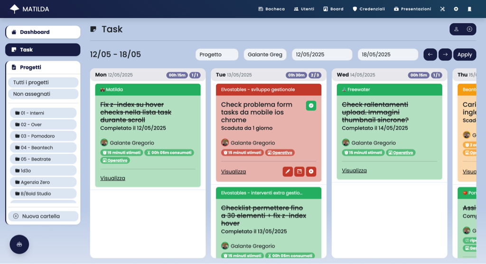
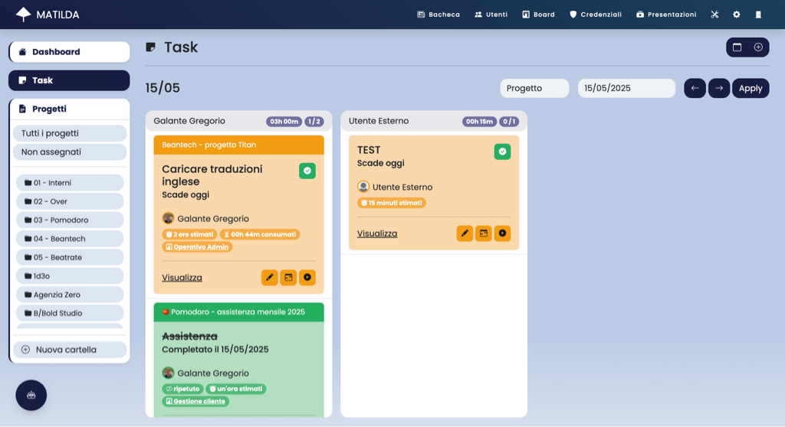

# ☂ Matilda - Project manager for better companies

Matilda è un'**applicazione web per la gestione dei progetti**, sviluppata in Ruby on Rails. È progettata per essere utilizzata da team di lavoro e offre funzionalità come la gestione dei task, la pianificazione delle attività e la collaborazione tra membri del team.

L'applicazione è dotata di un'interfaccia utente intuitiva e reattiva, che consente agli utenti di navigare facilmente tra le diverse funzionalità. Matilda è progettata per essere scalabile e può essere utilizzata da piccole startup a grandi aziende.

Matilda è un progetto open source e può essere utilizzata liberamente. È possibile contribuire al progetto segnalando bug, suggerendo nuove funzionalità o contribuendo con codice.


## Funzionalità

Matilda è strutturato in moduli. Ogni modulo fornisce funzionalità specifiche, si integra con altri moduli e può essere limitato agli utenti tramite specifici permessi.

### Task

Consente di visualizzare in modo centralizzato tutte le task gestite. La visualizzazione può essere attivata in due modalità:

- **Calendario**: consente di visualizzare le task in un calendario settimanale per identificare le scadenze e il carico di lavoro giorno per giorno
- **Utenti**: consente di visualizzare le task giornaliere per ogni utente, in modo da identificare il carico di lavoro di ciascun membro del team

<div style="display: flex; justify-content: space-between;">
    
    
</div>

### Progetti

Consente di creare, modificare e cancellare progetti. Ogni progetto è composto dalle seguenti aree:

- **Board di progetto**: consente di creare specifiche board per il progetto (simile a Trello)
- **Note**: consente di creare note testuali legate al progetto
- **Partecipanti**: consente di invitare e gestire i partecipanti al progetto
- **Board aziendali**: consente di inserire il progetto stesso all'interno di una o più board aziendali
- **Allegati**: consente di caricare e gestire file allegati al progetto
- **Presentazioni**: consente di creare presentazioni visuali legate al progetto

### Board

Consente di visualizzare e gestire tutte le board registrate nell'applicazione (simile a Trello). Le board possono essere di due tipologie:

- **Board aziendali**: board i cui elementi sono i progetti registrati nell'applicazione
- **Board di progetto**: board i cui elementi sono le task registrate all'interno del progetto

All'interno della sezione "Board" è possibile gestire anche i modelli di board, che consentono di creare specifici modelli riutilizzabili nei diversi progetti.

### Credenziali

Consente di gestire le credenziali aziendali, che possono essere utilizzate per accedere a servizi esterni. Le credenziali vengono crittografate e memorizzate in modo sicuro all'interno dell'applicazione.

### Presentazioni

Consente di creare presentazioni visive legate ai progetti. Le presentazioni possono essere create utilizzando immagini e testi. È possibile utilizzare le presentazioni per comunicare in modo efficace le informazioni sui progetti dell'azienda.

### Utenti

Consente di gestire gli utenti dell'applicazione e i relativi permessi.

### Bacheca

La bacheca consente di pubblicare articoli e notizie aziendali.

## Installazione

L'applicazione può essere installata in locale o su un server cloud su un environment standard per Ruby on Rails.
L'applicazione non richiede specifiche dipendenze, ma è consigliato l'uso di PostgreSQL come database.

### Requisiti

- Ruby 3.2.0
- SQLite3 o PostgreSQL

### Installazione

```bash
# Clona il repository
git clone
cd matilda
# Installa le dipendenze
bundle install
# Crea il database
rails db:create
# Esegui le migrazioni
rails db:migrate
# Popola il database con i dati di esempio
rails db:seed
# Avvia il server
rails server
```

### Configurazione

Per eseguire l'applicazione correttamente è necessario configurare le seguenti variabili d'ambiente:

#### Impostazioni Rails

- `RAILS_ENV`: Ambiente di esecuzione dell'applicazione (default: `development`)
- `RAILS_SERVE_STATIC_FILES`: Serve i file statici (default: `false`)
- `RAILS_LOG_TO_STDOUT`: Invia i log a STDOUT (default: `false`)

#### Impostazioni di sicurezza

- `SECRET_KEY_BASE`: Chiave segreta per la generazione dei token di autenticazione
- `ACTIVE_RECORD_ENCRYPTION_PRIMARY_KEY`: Chiave primaria per la crittografia dei dati sensibili
- `ACTIVE_RECORD_ENCRYPTION_DETERMINISTIC_KEY`: Chiave deterministica per la crittografia dei dati sensibili
- `ACTIVE_RECORD_ENCRYPTION_KEY_DERIVATION_SALT`: Sale per la derivazione della chiave di crittografia

#### Configurazione del database

- `DATABASE_URL`: URL di connessione al database PostgreSQL (Se non specificato, l'applicazione utilizzerà SQLite3)

#### Configurazione SMTP per l'invio delle email

- `SMTP_USER_NAME`: Nome utente per l'invio delle email (se non specificato, l'applicazione non invierà email)
- `SMTP_PASSWORD`: Password per l'invio delle email (se non specificato, l'applicazione non invierà email)
- `SMTP_ADDRESS`: Indirizzo del server SMTP (se non specificato, l'applicazione non invierà email)
- `SMTP_DOMAIN`: Dominio del server SMTP (se non specificato, l'applicazione non invierà email)
- `SMTP_PORT`: Porta del server SMTP (se non specificato, l'applicazione non invierà email)

#### Configurazione del bucket S3 compatibile

- `BUCKET_ACCESS_KEY`: Chiave di accesso per il bucket S3 (se non specificato, l'applicazione utilizzerà il filesystem locale)
- `BUCKET_ACCESS_KEY_SECRET`: Chiave segreta per il bucket S3 (se non specificato, l'applicazione utilizzerà il filesystem locale)
- `BUCKET_REGION`: Regione del bucket S3 (se non specificato, l'applicazione utilizzerà il filesystem locale)
- `BUCKET_NAME`: Nome del bucket S3 (se non specificato, l'applicazione utilizzerà il filesystem locale)

##### Configurazione di Matilda

- `MATILDA_MAIL_FROM`: Indirizzo email del mittente (default  `Matilda <noreply@mail.com>`)
- `MATILDA_HOST`: Indirizzo host dell'applicazione (default `matilda.local`)

#### Alternartiva - credentials.yml.enc

In alternativa, è possibile utilizzare il file `config/credentials.yml.enc` per memorizzare le variabili d'ambiente. Per farlo, eseguire il comando:

```bash
EDITOR="nano" rails credentials:edit
```

Di seguito è riportato un esempio di file `credentials.yml.enc`:

```yaml
# config/credentials.yml.enc
secret_key_base: example_secret_key_base

active_record_encryption:
  primary_key: example_primary_key
  deterministic_key: example_deterministic_key
  key_derivation_salt: example_key_derivation_salt

smtp:
  user_name: user_name@mail.com
  password: example_password
  domain: example.com
  address: mail.example.com
  port: 587

bucket:
  region: eu-central-1
  access_key_id: example_access_key_id
  access_key_secret: example_access_key_secret
  bucket: example_bucket
```

## Integrazioni

### Slack

Matilda può essere integrata con Slack per inviare notifiche e aggiornamenti sui progetti direttamente nel canale Slack del team. Per configurare l'integrazione con Slack, è necessario creare un'app Slack e configurare i seguenti parametri:

```json
{
    "display_information": {
        "name": "Matilda",
        "description": "Project manager for better companies",
        "background_color": "#181d45"
    },
    "features": {
        "bot_user": {
            "display_name": "Matilda",
            "always_online": false
        },
        "slash_commands": [
            {
                "command": "/search_attachment",
                "url": "https://MATILDA_HOST/slack/search-project-attachment",
                "description": "Search project attachments",
                "should_escape": false
            },
            {
                "command": "/search_log",
                "url": "https://MATILDA_HOST/slack/search-project-log",
                "description": "Search project logs",
                "should_escape": false
            }
        ]
    },
    "oauth_config": {
        "scopes": {
            "bot": [
                "incoming-webhook",
                "channels:manage",
                "chat:write",
                "commands",
                "groups:write",
                "users:read"
            ]
        }
    },
    "settings": {
        "org_deploy_enabled": false,
        "socket_mode_enabled": false,
        "token_rotation_enabled": false
    }
}
```
