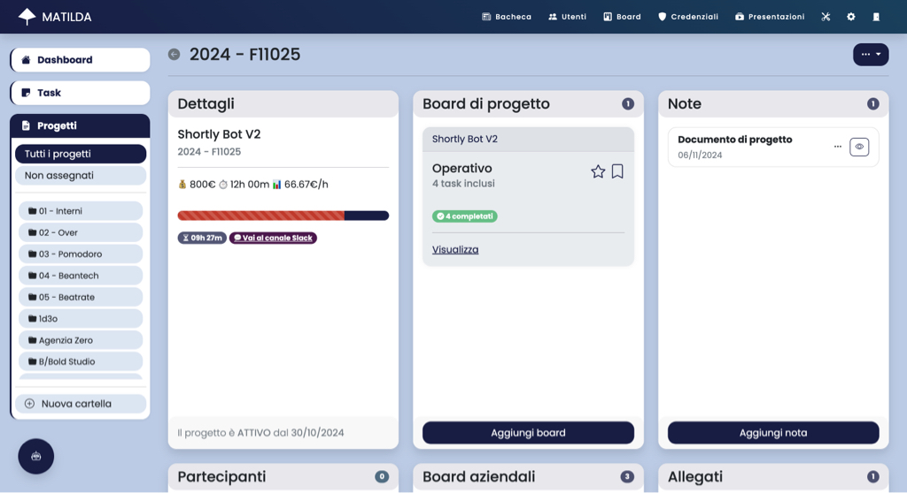
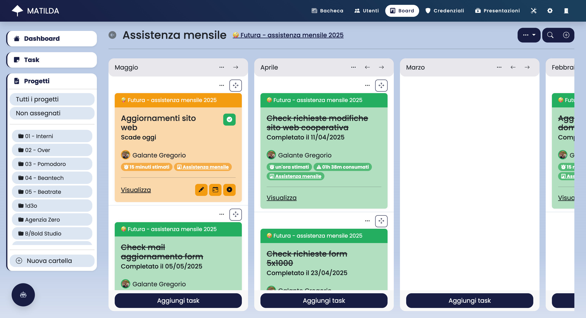

# ☂ Matilda - Project manager for better companies

Matilda è un'**applicazione web per la gestione dei progetti**, sviluppata in Ruby on Rails. È progettata per essere utilizzata da team di lavoro e offre funzionalità come la gestione dei task, la pianificazione delle attività e la collaborazione tra membri del team.

L'applicazione è dotata di un'interfaccia utente intuitiva e reattiva, che consente agli utenti di navigare facilmente tra le diverse funzionalità. Matilda è progettata per essere scalabile e può essere utilizzata da piccole startup a grandi aziende.

Matilda è un progetto open source e può essere utilizzata liberamente. È possibile contribuire al progetto segnalando bug, suggerendo nuove funzionalità o contribuendo con codice.


## 📋 Funzionalità

Matilda è strutturato in moduli. Ogni modulo fornisce funzionalità specifiche, si integra con altri moduli e può essere limitato agli utenti tramite specifici permessi.

### Task

Le task sono definite da un titolo, una descrizione, una scadenza e un tempo stimato di lavoro; possono inoltre includere una checklist di sotto-attività da portare a termine.
Le task possono essere assegnate a un utente e possono essere seguite da altri utenti per monitorare il progresso del lavoro.
Le task possono essere anche impostate come "ripetitive", in modo da essere automaticamente create in base a una pianificazione definita.

Per ogni task può essere effettuato il time tracking, in modo da registrare il tempo effettivo impiegato per completare il lavoro.

La sezione "Task" consente di visualizzare in modo centralizzato tutte le task gestite. La visualizzazione può essere attivata in due modalità:

- **Calendario**: consente di visualizzare le task in un calendario settimanale per identificare le scadenze e il carico di lavoro giorno per giorno
- **Utenti**: consente di visualizzare le task giornaliere per ogni utente, in modo da identificare il carico di lavoro di ciascun membro del team

<div style="display: flex; justify-content: space-between;">
    
    
</div>

### Progetti

I progetti sono l'elemento centrale dell'applicazione. Ogni progetto è un aggregatore di informazioni e dati legati a un'attività specifica. I progetti possono essere utilizzati per gestire attività di lavoro, eventi, campagne di marketing e altro ancora.

La sezione "Progetti" consente di creare, modificare e cancellare progetti. Ogni progetto è composto dalle seguenti aree:

- **Board di progetto**: consente di creare specifiche board per il progetto (simile a Trello)
- **Note**: consente di creare note testuali legate al progetto
- **Partecipanti**: consente di invitare e gestire i partecipanti al progetto
- **Board aziendali**: consente di inserire il progetto stesso all'interno di una o più board aziendali
- **Allegati**: consente di caricare e gestire file allegati al progetto
- **Presentazioni**: consente di creare presentazioni visuali legate al progetto

<div style="display: flex; justify-content: space-between;">
    
    
</div>

### Board

Le board sono uno strumento fondamentale per la gestione dei progetti.
Le board consentono di visualizzare le task e i progetti in modo chiaro e intuitivo. Ogni board è composta da una serie di colonne, ognuna delle quali rappresenta uno stato specifico di un processo aziendale.
Le colonne possono essere personalizzate in base alle esigenze dell'azienda e possono essere utilizzate per rappresentare stati come "Da fare", "In corso" e "Completato".

La sezione "Board" consente di visualizzare e gestire tutte le board registrate nell'applicazione. Le board possono essere di due tipologie:

- **Board aziendali**: board i cui elementi sono i progetti registrati nell'applicazione
- **Board di progetto**: board i cui elementi sono le task registrate all'interno del progetto

All'interno della sezione "Board" è possibile gestire anche i modelli di board, che consentono di creare specifici modelli riutilizzabili nei diversi progetti.

<div style="display: flex; justify-content: space-between;">
    
    
</div>

### Credenziali

La sezione "Credenziali" consente di gestire le credenziali aziendali (username, password) ai vari servizi esterni. Le credenziali vengono crittografate e memorizzate in modo sicuro all'interno dell'applicazione.

### Presentazioni

La sezione "Presentazioni" consente di creare presentazioni visive legate ai progetti. Le presentazioni possono essere create utilizzando immagini e testi. È possibile utilizzare le presentazioni per comunicare in modo efficace le informazioni sui progetti dell'azienda o mostrare wireframe e mockup.

### Bacheca

La sezione "Bacheca" consente di pubblicare articoli e notizie aziendali visualizzabili da tutti gli utenti registrati nell'applicazione. Gli articoli possono essere utilizzati per comunicare informazioni importanti sui progetti e sull'azienda.

### Utenti

La sezione "Utenti" consente di gestire gli utenti dell'applicazione e i relativi permessi.

### Assistente virtuale 🤖

L'assistente virtuale consente di sfruttare funzionalità di intelligenza artificiale all'interno dell'applicazione. L'assistente virtuale può essere utilizzato sotto forma di chatbot per interagire con i dati dell'applicazione o sotto forma di micro-servizi che semplificano le attività quotidiane.

## 👉 Richiedi una demo

Per richiedere una demo dell'applicazione, è possibile contattare il team di sviluppo all'indirizzo email [matilda@gregoriogalante.com](mailto:matilda@gregoriogalante.com).

## 🧑‍💻 Installazione

L'applicazione può essere installata in locale o su un server cloud su un environment standard per Ruby on Rails.
L'applicazione non richiede specifiche dipendenze, ma è consigliato l'uso di PostgreSQL come database.

### Requisiti

- Ruby 3.2.0
- SQLite3 o PostgreSQL

### Installazione

```bash
# Clona il repository
git clone
cd matilda
# Installa le dipendenze
bundle install
# Crea il database
rails db:create
# Esegui le migrazioni
rails db:migrate
# Popola il database con i dati di esempio
rails db:seed
# Avvia il server
rails server
```

### Configurazione

Per eseguire l'applicazione correttamente è necessario configurare le seguenti variabili d'ambiente:

#### Impostazioni Rails

- `RAILS_ENV`: Ambiente di esecuzione dell'applicazione (default: `development`)
- `RAILS_SERVE_STATIC_FILES`: Serve i file statici (default: `false`)
- `RAILS_LOG_TO_STDOUT`: Invia i log a STDOUT (default: `false`)

#### Impostazioni di sicurezza

- `SECRET_KEY_BASE`: Chiave segreta per la generazione dei token di autenticazione
- `ACTIVE_RECORD_ENCRYPTION_PRIMARY_KEY`: Chiave primaria per la crittografia dei dati sensibili
- `ACTIVE_RECORD_ENCRYPTION_DETERMINISTIC_KEY`: Chiave deterministica per la crittografia dei dati sensibili
- `ACTIVE_RECORD_ENCRYPTION_KEY_DERIVATION_SALT`: Sale per la derivazione della chiave di crittografia

#### Configurazione del database

- `DATABASE_URL`: URL di connessione al database PostgreSQL (Se non specificato, l'applicazione utilizzerà SQLite3)

#### Configurazione SMTP per l'invio delle email

- `SMTP_USER_NAME`: Nome utente per l'invio delle email (se non specificato, l'applicazione non invierà email)
- `SMTP_PASSWORD`: Password per l'invio delle email (se non specificato, l'applicazione non invierà email)
- `SMTP_ADDRESS`: Indirizzo del server SMTP (se non specificato, l'applicazione non invierà email)
- `SMTP_DOMAIN`: Dominio del server SMTP (se non specificato, l'applicazione non invierà email)
- `SMTP_PORT`: Porta del server SMTP (se non specificato, l'applicazione non invierà email)

#### Configurazione del bucket S3 compatibile

- `BUCKET_ACCESS_KEY`: Chiave di accesso per il bucket S3 (se non specificato, l'applicazione utilizzerà il filesystem locale)
- `BUCKET_ACCESS_KEY_SECRET`: Chiave segreta per il bucket S3 (se non specificato, l'applicazione utilizzerà il filesystem locale)
- `BUCKET_REGION`: Regione del bucket S3 (se non specificato, l'applicazione utilizzerà il filesystem locale)
- `BUCKET_NAME`: Nome del bucket S3 (se non specificato, l'applicazione utilizzerà il filesystem locale)

#### Configurazione di Matilda

- `MATILDA_MAIL_FROM`: Indirizzo email del mittente (default  `Matilda <noreply@mail.com>`)
- `MATILDA_HOST`: Indirizzo host dell'applicazione (default `matilda.local`)

### Configurazione alternativa -> credentials.yml.enc

In alternativa, è possibile utilizzare il file `config/credentials.yml.enc` per memorizzare le variabili d'ambiente. Per farlo, eseguire il comando:

```bash
EDITOR="nano" rails credentials:edit
```

Di seguito è riportato un esempio di file `credentials.yml.enc`:

```yaml
# config/credentials.yml.enc
secret_key_base: example_secret_key_base

active_record_encryption:
  primary_key: example_primary_key
  deterministic_key: example_deterministic_key
  key_derivation_salt: example_key_derivation_salt

smtp:
  user_name: user_name@mail.com
  password: example_password
  domain: example.com
  address: mail.example.com
  port: 587

bucket:
  region: eu-central-1
  access_key_id: example_access_key_id
  access_key_secret: example_access_key_secret
  bucket: example_bucket
```

## 💬 Integrazioni

### Slack

Matilda può essere integrata con Slack per creare automaticamente i canali dei progetti e inviare notifiche e aggiornamenti. Per configurare l'integrazione con Slack, è necessario creare un'app Slack e inserire i seguenti parametri di configurazione:

```json
{
    "display_information": {
        "name": "Matilda",
        "description": "Project manager for better companies",
        "background_color": "#181d45"
    },
    "features": {
        "bot_user": {
            "display_name": "Matilda",
            "always_online": false
        },
        "slash_commands": [
            {
                "command": "/search_attachment",
                "url": "https://MATILDA_HOST/slack/search-project-attachment",
                "description": "Search project attachments",
                "should_escape": false
            },
            {
                "command": "/search_log",
                "url": "https://MATILDA_HOST/slack/search-project-log",
                "description": "Search project logs",
                "should_escape": false
            }
        ]
    },
    "oauth_config": {
        "scopes": {
            "bot": [
                "incoming-webhook",
                "channels:manage",
                "chat:write",
                "commands",
                "groups:write",
                "users:read"
            ]
        }
    },
    "settings": {
        "org_deploy_enabled": false,
        "socket_mode_enabled": false,
        "token_rotation_enabled": false
    }
}
```
